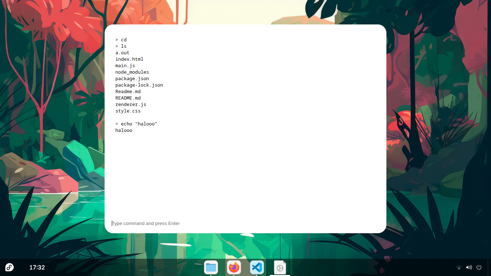

# Handy Terminal - Electron Lightweight Terminal

**A portable, lightweight, and distraction-free terminal.**

Handy Terminal is built for users who value simplicity and focus.  
It delivers a clean, minimal interface with an interactive shell that stays out of your way.

No bloat. No visual noise. Just a terminal that works.

---

## Why Handy Terminal?

### Portable
Run it anywhere with minimal setup. Handy Terminal is designed to be easy to deploy and effortless to use.

### Simple by Design
The interface is intentionally minimal. Every element serves a purpose, allowing you to focus entirely on your commands.

### Lightweight
Optimized for performance and low resource usage. Smooth and responsive, even on modest systems.

### To-the-Point Terminal
No unnecessary features or complex workflows. Handy Terminal provides exactly what a terminal should, nothing more.

---

### Shortcut
- Ctrl + N = New Window
- Ctrl + Escape = Close
- Ctrl + Delete = Clear
- Ctrl + N = Close App
- Alt + Mouse-drag = Move Window

## Design Philosophy

A terminal should be fast, clear, and invisible when you use it.

Handy Terminal removes distractions and keeps the experience straightforward, letting you work efficiently without interruption.

---

## Built For

- Users who prefer clean and minimal tools
- Users who want a lightweight, portable terminal
- Anyone who values clarity over complexity

---

## Status

Handy Terminal is under active development.  
Features are added only when they improve usability while preserving simplicity.

---

## Get Started

Clone the repository.

---

## Packages Use
- Node.js
- Electron
- node-pty

---

## License

MIT License
